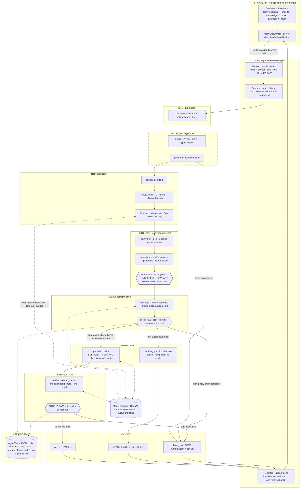

# ResolveAI architecture

ResolveAI is an evidence-grounded AI support agent for AppleSupport, built on the public *Customer Support on Twitter* dataset.
It is a production-style **reference implementation**, not a deployed service: one Python process serves the API and a Next.js
console, and there is no Docker and no external infrastructure. Measured results are in `artifacts/final/FINAL_REPORT.md`, and
what is and is not ready for a real deployment is in `docs/PRODUCTION_READINESS.md`.

**The system in one line:** ResolveAI does not ask an LLM to answer. Deterministic code decides whether a reply is allowed, and
the model only helps with bounded tasks inside that decision.

## 1. The final system contract

**Input**
- The customer message to handle.
- Optional earlier turns (customer or brand).
- Optional metadata: channel, locale, timestamp, and a hashed customer id that is validated and then discarded.

All input is **untrusted data**.

**Output: exactly one action**, always with a reason code, the policy rule that fired, the policy version, the evidence used, and
a `trace_id` and `request_id`.

| Action | What the customer would get | Extra payload |
|---|---|---|
| `AUTO_HANDLE` | a verified reply citing historical cases (or a fixed template for a closure or a non-English redirect) | `evidence_refs`, verification |
| `CLARIFICATION_REQUIRED` | one clarifying question; no answer | `ClarificationPacket` (why, what is missing, what was already given) |
| `HUMAN_HANDOFF` | a holding line; no answer | `HandoffPacket` for the human (issue, intent, risk flags, evidence, next action, rejected draft if any) |

**The 13 steps**, one orchestrator (`resolveai/agent/orchestrator.py`), shared by the API, the CLI, the demo and the evaluation
harness:

| # | Step | Component | Model? | Can it stop an automatic reply? | On failure |
|---|---|---|---|---|---|
| 1 | PII protection | `trust/pii.py` (typed tokens `<EMAIL> <PHONE> <ORDER_ID> <CARD> <LONG_ID>`) and `trust/injection.py` | no | yes (injection = hard handoff; customer identifiers route to private handling) | handoff |
| 2 | Context construction | `intelligence/context.py` (at most 2 customer turns + 1 brand turn, 600 chars) | no | no | `dependency_failure` handoff |
| 3 | Intent classification | `intelligence/classifier.py` (BGE-small embedding + calibrated logistic regression, HIGH/MEDIUM/LOW bands) | no | via low confidence | `dependency_failure` handoff |
| 4 | Optional LLM second opinion | `agent/second_opinion.py` (LOW/MEDIUM confidence only; adopted only if it names a top-3 alternative) | yes | no | classifier intent kept |
| 5 | Retrieval | `retrieval/engine.py`, `dense.py`, `rerank.py`, `resolution.py` (pair index over 17,875 earlier cases, resolution rerank, clusters, quarantine, re-redaction) | no | yes (no evidence) | `dependency_failure` handoff |
| 6 | Evidence sufficiency | gate-v3 (`retrieval/gate_v3_config.json`): INSUFFICIENT / WEAK / SUFFICIENT / STRONG | no | **yes** | handoff |
| 7 | Risk extraction | `agent/risk.py`: deterministic rules OR model flags; the model can add flags, never clear one, and `needs_private_info` counts only with the rule | yes (skipped when a handoff is already guaranteed) | yes | rules only |
| 8 | Deterministic policy | `policy/escalation.py` policy-v3.3: 27 ordered rules, first match names the reason; greetings, thanks, bare acknowledgements, explicit requests for a person and non-Latin scripts are recognised deterministically by `intelligence/conversation_acts.py` | no | **yes** | handoff |
| 9 | Grounded drafting | `agent/drafter.py` (only on SUFFICIENT/STRONG evidence; must cite evidence ids); `clarify.py`, `handoff.py` are templates | yes | yes (no draft, no reply) | `model_timeout` / `llm_unavailable` handoff |
| 10 | Verification | `agent/verifier.py`: lexical gates (coverage, references exist, no URL/PII/promises) + model support check; one corrective redraft | yes | **yes** | handoff (never ships unverified) |
| 11 | Output gate | `agent/gate.py` output-gate-v1: 9 checks, all required | no | **yes** | handoff |
| 12 | Action | `AUTO_HANDLE` / `CLARIFICATION_REQUIRED` / `HUMAN_HANDOFF` | no | — | — |
| 13 | Trace | `observability/trace.py`: one `AgentTrace` per execution; an automatic reply is withheld if the trace cannot be written | no | yes (`audit_unavailable`) | handoff |

## 2. The invariant

> **NO SUFFICIENT EVIDENCE → NO AUTONOMOUS CUSTOMER REPLY.**

It is enforced in five independent places, and an adversarial test covers each (`tests/test_phase9_adversarial.py`,
`tests/test_final_adversarial_suite.py`):
1. **Policy.** `policy.decide` refuses automation unless `EvidenceSet.sufficient` holds.
2. **Drafter.** It refuses to draft without sufficient evidence (`LLMUnavailable(kind="no_input")`).
3. **Verifier.** Every sentence needs evidence coverage and every cited id must exist; an approving model cannot override a failed
   lexical check.
4. **Output gate.** `evidence_sufficient`, `evidence_refs_exist` and `response_verified` are among its nine required checks.
5. **API presenter.** `resolveai/api/presenter.py` re-checks the result independently and returns 500
   `autonomy_invariant_violation`, withholding the text, if an automatic reply breaks it.

Weak, contradictory or missing evidence therefore produces a clarifying question or a handoff, never a best guess. A model
failure produces a handoff, never an ungrounded reply.

## 3. Architecture diagram



<details><summary>Plain-text version</summary>

```text
browser ──> Next.js console ──(TB1: token added server side)──> FastAPI: auth + scopes + rate limits + body/schema limits
  ──> [TRUST] PII redaction (PII removed here) ──> injection detector ──(detected)──> HUMAN_HANDOFF
  ──> [INTELLIGENCE] context ──> BGE+LR intent ──> LLM second opinion (LOW/MEDIUM only)      ─┐
  ──> [RETRIEVAL] pair index ──> rerank + clusters + quarantine ──> EVIDENCE GATE (gate-v3)   │ model calls: redacted text only,
  ──> [POLICY] risk flags (rules OR model; model cannot clear) ──> DETERMINISTIC POLICY       │ timeout + request budget,
        ├─ automation allowed AND evidence sufficient ──> [GENERATION] grounded draft ───────┤ output treated as untrusted (TB3)
        │                                                  ──> [VERIFICATION] verifier ──────┘
        │                                                  ──> OUTPUT GATE (9 checks) ──pass──> AUTO_HANDLE
        │                                                                              └─fail──> HUMAN_HANDOFF
        ├─ thin evidence, no risk ──> clarifying question (template) ──> CLARIFICATION_REQUIRED
        └─ risk / policy / model failure ──> handoff packet ──> HUMAN_HANDOFF
  ──> [API] presenter re-checks the invariant (500 + reply withheld if broken) ──> console
  every stage ──> [OBSERVABILITY] AgentTrace (ids, versions, statuses, latency, failure codes; no customer text)
```
</details>

## 4. Trust boundaries

| # | Boundary | What crosses it | Controls |
|---|---|---|---|
| TB1 | Browser → console server → API | operator requests | The browser never holds the API token; the same-origin forwarder adds it server side and never forwards a browser `Authorization` header. The API requires a bearer token with the right scope in `production`, rate limits per principal and failed-authentication limits, and caps body size before parsing. |
| TB2 | Request → agent | customer and brand turns | Schema rejects unknown fields, so evidence cannot be supplied by a caller. PII is redacted first. The injection detector runs on every turn; a detection is a hard handoff before any model call. |
| TB3 | Agent ↔ model provider | redacted prompts out; untrusted text in | `LLMClient` refuses unredacted PII, enforces a wall-clock timeout per call and a per-request budget, and validates structured output. Model output is treated as data: risk flags can only add to the rules, drafts must pass the verifier and the output gate, and the model never decides escalation. |
| TB4 | Knowledge base → agent | historical customer and support text | Historical text is data, never instructions. Items that read as instructions are quarantined before the gate. Evidence text is redacted again. Only rows earlier than the message are eligible, and golden rows are never indexed. |
| TB5 | Agent → trace store and logs | decisions and metadata | Traces store ids, versions, statuses, latency and failure codes, never customer text or reasoning. The schema rejects keys such as `reasoning`, `raw_text`, `authorization`, `token` and `api_key`, and the recorder refuses PII. Logs carry request metadata and redacted exception text only. |
| TB6 | Agent → API response | the result | The presenter re-checks the invariant and echoes only the redacted conversation. Error bodies never echo input. |

## 5. Where the model is used, and what it cannot do

| Role | Where | Can do | Cannot do |
|---|---|---|---|
| Intent second opinion | step 4 | propose an intent at LOW/MEDIUM confidence | override a HIGH-confidence classifier, or introduce an intent outside the classifier's top 3 |
| Risk flags | step 7 | add flags such as repeat contact or damage | clear a rule flag, or raise `needs_private_info` without the rule |
| Drafting | step 9 | write a reply from the labelled evidence, citing ids | draft without sufficient evidence, cite ids that do not exist, or ship without verification |
| Verification | step 10 | reject a draft whose steps the evidence does not support | approve a draft that failed the deterministic checks |
| Judge (evaluation only) | `resolveai/evaluation/judge.py` | score responses on the frozen rubric-v1 | influence any agent decision |

Everything else is deterministic code: classification, retrieval, ranking, the evidence gate, the escalation policy, templates,
the output gate and the API checks.

## 6. Failure hierarchy

| Failure | Result | Recorded as |
|---|---|---|
| Input problem (vague, no symptom, missing context) | `CLARIFICATION_REQUIRED` | reason `insufficient_context`, `low_confidence` or `insufficient_evidence` |
| Model timeout or request budget spent | `HUMAN_HANDOFF` | `model_timeout`; `failures[{category, stage, kind}]` |
| Model outage or invalid output | `HUMAN_HANDOFF` (HTTP 200) | `llm_unavailable`; kind `transport` or `invalid_output` |
| Risk model fails | deterministic rules only (the measured safety floor) | risk stage `fallback` |
| Retrieval, embedding, classifier or verifier crash | `HUMAN_HANDOFF` | `dependency_failure`, rule `dependency:<stage>` |
| Trace cannot be written | automatic reply withheld → `HUMAN_HANDOFF` | `audit_unavailable`, blocking check `audit_trace_written` |
| Policy or safety reason | `HUMAN_HANDOFF` | the policy reason code |
| Unexpected server error | 500 with request id | redacted log |

## 7. Layers and packages

| Layer | Package | Key contracts |
|---|---|---|
| INPUT / API | `resolveai/api/` (`app`, `access`, `auth`, `settings`, `guards`, `schemas`, `presenter`, `service`, `routes`, `errors`) | `ResolveRequest`, `ResolveResponse`, one error body |
| TRUST | `resolveai/trust/` | `redact_pii`, `detect_injection` |
| INTELLIGENCE | `resolveai/intelligence/`, `resolveai/models/` | `ContextBundle`, `IntentResult`, taxonomy v1.1 (`docs/INTENTS.md`) |
| RETRIEVAL | `resolveai/retrieval/` | `EvidenceSet` (items with provenance, sufficiency level, resolution confidence, clusters, quarantined ids) |
| POLICY | `resolveai/policy/`, `resolveai/agent/risk.py` | `RiskFlags`, `EscalationResult` |
| GENERATION | `resolveai/agent/drafter.py`, `clarify.py`, `handoff.py` | `DraftResponse`, `ClarificationPacket`, `HandoffPacket` |
| VERIFICATION | `resolveai/agent/verifier.py`, `gate.py` | `VerificationResult`, `AutomationDecision` |
| OUTPUT | `resolveai/agent/orchestrator.py`, `explain.py` | `AgentResult`, `DecisionSummary`, `EvidenceRef` |
| OBSERVABILITY | `resolveai/observability/`, `resolveai/llm/` (usage, cache) | `AgentTrace`, `ModelUsage` |
| MODEL ACCESS | `resolveai/llm/` | `LLMClient` (timeouts, budget, classified failures, SHA-256 response cache) |
| EVALUATION | `resolveai/evaluation/` (never imports agent decision logic) | `SystemRecord`, metrics, bootstrap, judge |
| FRONTEND | `frontend/` (Next.js 16, React 19, TypeScript, Tailwind) | types generated from the API's OpenAPI document; read-only views `api/product.py` (`/evaluation/release`, `/agent/profile`, `/knowledge/summary`) |

### The operator console

The console is a product shell over the same API. It holds no agent logic and never decides anything:

| Area | Pages | What they read |
|---|---|---|
| Operate | Overview, Conversations (three-panel workspace), Handoffs, Simulator | `/traces`, `/resolve`, `/ready`, `/config`, `/evaluation/release`, results stored in the operator's browser |
| Knowledge & agents | Knowledge Center, Agent configuration (read-only) | `/knowledge/summary`, `/agent/profile`, `/evaluation/release` |
| Govern | Evaluation Center, Trace Explorer, Trust & Governance | `/evaluation/release`, `/evaluation/summary`, `/traces/{id}`, `/config` |
| System | Settings | `/config`, `/health`, the console server's own environment (token presence only) |

The principle shown throughout: **model proposes · evidence grounds · policy decides · verifier checks · humans control
exceptions.** "Why did ResolveAI do this?" (`frontend/lib/explain.ts`) is assembled from structured decision data (outcome,
evidence gate, policy rule, risk flags, verification, output gate, or a trace's recorded events); no model is asked to explain
itself. Live operational data, frozen golden-set results, dev experiments and performance profiles carry separate labels and are
never combined.

## 8. Release configuration (1.0.0)

| Component | Version |
|---|---|
| Pipeline | `pipeline-v6.3` (final product pass: a bare greeting gets a template without retrieval or model calls, an explicit request for a person is a handoff, a short reply is classified with the issue it answers, capitalization and repeated "!" are never risk signals, the English-only redirect obeys the confidence floor, and a non-Latin script is read off the characters). Release 1.0.0 was evaluated with `pipeline-v6.1` (model-only `needs_private_info` requires the deterministic rule); the golden run was not repeated, and `scripts/evaluation/behaviour_change_impact.py` lists the 21 of 197 golden rows that reach a changed code path |
| Policy / output gate | `policy-v3.3` (evaluated: `policy-v3.1`) / `output-gate-v1` |
| Retrieval / evidence gate / rerank | `dense:bge-small:pair+rr+gatev3` / `gate-v3` / `rerank-v1` |
| Prompts | risk `risk-flags-v2`, draft `draft-v2`, verify `verify-v2`, second opinion `intent-second-opinion-v1` |
| Model | GLM-5.2 through an OpenAI-compatible endpoint (`LLM_BASE_URL`, `LLM_API_KEY`, `LLM_MODEL`) |
| Classifier | `resolveai/models/artifacts/intent_bge_lr.json` (hash in every response's `versions.classifier`) |

Every response and trace carries these versions and a `config_hash`.

## 9. Data, caching and evaluation contracts

- **Data.** The Kaggle file is never modified or committed. `data/processed/apple_pairs.csv` (18,000 KB + 2,000 holdout pairs, seed
  42) is committed. The temporal split uses `created_at`: the holdout is the final 5 days, and every KB row is earlier.
- **Golden set.** `data/golden/golden_final.csv` holds 197 rows, is hash-verified on every load and is never indexed. See
  `docs/EVALUATION.md`.
- **Cache.** Model responses are cached under SHA-256 keys of (model, prompt version, messages, parameters), so evaluations replay
  without an API key. The cache (`.cache/llm`) and embeddings (`.cache/embeddings`) are local and gitignored. The committed run
  records are what the cached evaluation recomputes from.
- **Evaluation independence.** Metrics are pure functions over run records; the harness never imports agent decision logic.

## 10. Deliberately not built

| Not built | Why | Decision |
|---|---|---|
| Docker, Kubernetes, cloud deployment | out of scope; local Python and Node execution is enough to demonstrate the system | DECISIONS #13 |
| LangGraph or another agent framework | the pipeline is a DAG with one retry, and about 400 lines of explicit Python make every gate inspectable | #12, #32 |
| Vector database | 17,875 rows fit in memory with exact search (FAISS flat) | #12, #18 |
| Redis or a shared rate-limit store | one process runs one agent; limits are documented as process-local | #94 |
| OAuth or SSO | static scoped tokens fit a single-process reference; operator login is NOT READY | #93 |
| Model-owned escalation | Phase 1A: every model's escalation accuracy was at or below a never-escalate baseline | #6 |

## 11. Verified flow: no bypass path

The final product review checked that the running system follows one path and has no second way to produce a customer reply.

```text
Customer ─> TRUST (pii.py, injection.py) ─> INTELLIGENCE (context, classifier, second opinion) ─> RETRIEVAL (engine, rerank)
        ─> EVIDENCE GATE (gate-v3) ─> POLICY (risk flags, escalation.py) ─> GENERATION (drafter | clarify | handoff)
        ─> VERIFICATION (verifier, output gate, API re-check) ─> ACTION ─> TRACE
```

| Check | Finding |
|---|---|
| Entry points that run the agent | `POST /api/v1/resolve` (via `AgentService.resolve`), the CLI (`resolveai/agent/__main__.py`), the demo (`resolveai/demo.py`) and the evaluation harness (`resolveai/evaluation/systems.py`) all call the same `ResolveAI.resolve`. |
| Drafting | `drafter.draft_troubleshoot` is called only inside `orchestrator.py`, after the policy allows it and before verification and the output gate. |
| Other API routes | `/traces`, `/health`, `/ready`, `/config`, `/evaluation/summary`, `/evaluation/release`, `/agent/profile`, `/knowledge/summary`, `/demo/scenarios` only read; none produces a reply. |
| Baselines | B1 and B2 (the direct-LLM baseline) exist only in `resolveai/evaluation/` for measurement; no API route or console page runs them. |
| Console | No agent logic; the same-origin forwarder allows only the API's own endpoints (tested in `frontend/tests/proxy.test.ts`). |
| Invariant | An automatic reply that fails the evidence invariant is withheld by the API (500 `autonomy_invariant_violation`), tested adversarially. |

## 12. Text normalization and capitalization

The same words must behave the same however they are typed. Each use case uses the normalization it needs, and the customer's
original text is never replaced (it stays the input to redaction, classification, retrieval, display and the trace):

| Use case | Normalization | Why |
|---|---|---|
| Intent classification and dense retrieval | none needed | the BGE tokenizer lower-cases (`do_lower_case`); "my iphone is broken" and "MY IPHONE IS BROKEN" produce identical token ids |
| BM25, weak labels, verifier, resolution checks, clarification slot detection | lower-case or case-insensitive patterns | already case-insensitive |
| Injection detection | NFKC, invisible format characters removed, case-insensitive patterns, line breaks kept | full-width letters and zero-width characters cannot hide "ignore your previous instructions"; one pattern is line-anchored |
| Risk rules | NFKC, format characters removed, case-insensitive patterns; capitalization and repeated "!" are not signals | all-caps used to raise `high_frustration`, so "THANKS" was handed off while "thanks" was answered |
| Greetings, thanks, acknowledgements, requests for a person | NFKC, casefold, punctuation and emoji removed (`trust/normalize.py`, `intelligence/conversation_acts.py`) | "hi", "HI", "Hi!!" and "Ｈｉ" are one act |
| PII: email, phone, card, order id | case-insensitive by construction | |
| PII: serial / IMEI / case id | exact upper case, deliberately | a case-insensitive pattern newly matched 157 of 20,000 knowledge-base messages, almost all product hashtags ("iphone7plus") |
| API: trace ids, `action` filter, profile names | canonical form (lowercase hex, upper-case enum, lower-case profile) | an upper-case copy of an id or filter means the same thing |
| Console: search boxes and URL filters | NFKC, format characters removed, lower-case (`frontend/lib/text.ts`) | display text is unchanged |

Tests: `tests/test_case_and_conversation.py` (unit, agent and API) and `frontend/tests/product.test.tsx`.
